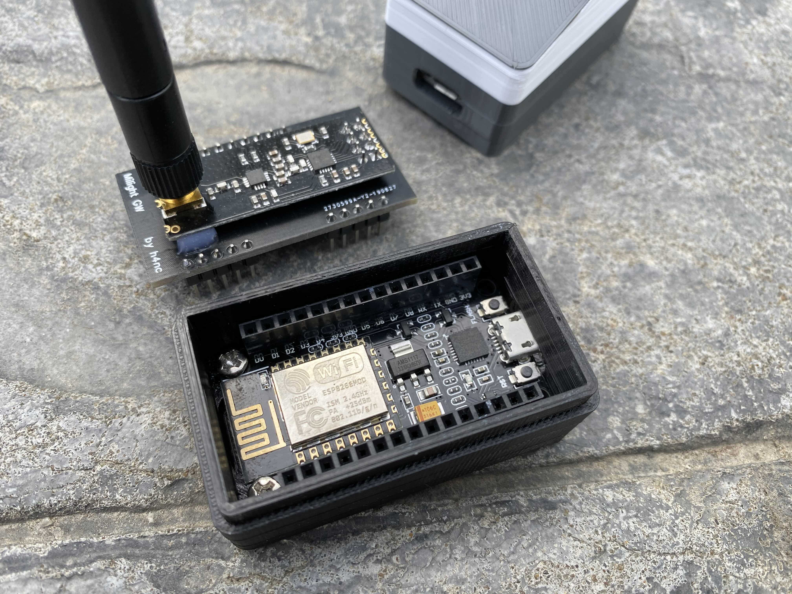
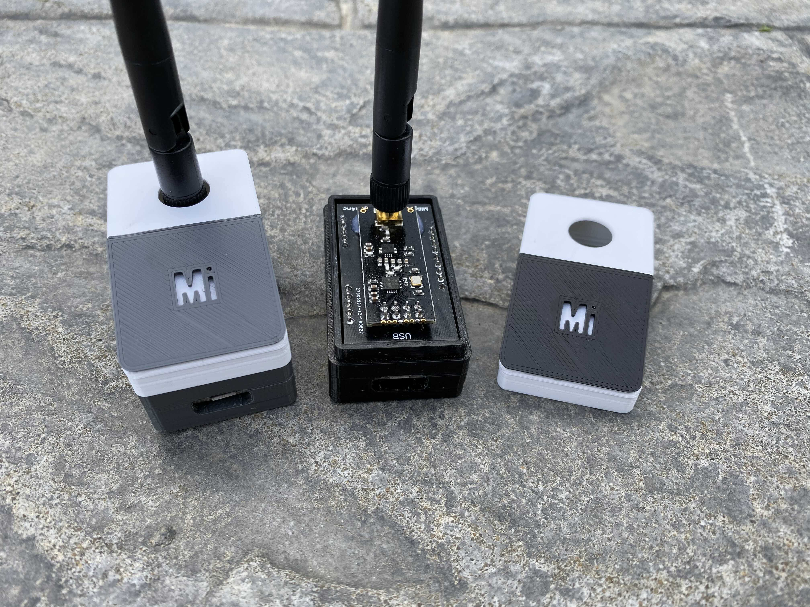

# ESP8266 MiLight Hub PCB

This project contains Gerber files for a PCB designed for [ESP8266 MiLight Hub](https://github.com/sidoh/esp8266_milight_hub) designed by h4nc.  He was gracious enough to share his work, and asked that I put it up on Github.

## Photos

## Case

STLs for the case are available on Thingiverse under a [CC BY-NC-ND 3.0 License](https://creativecommons.org/licenses/by-nc-nd/3.0/):

https://www.thingiverse.com/thing:3955348

## Ready-Made Hub

h4nc is offering ready-made kits which include:

* A NodeMCU pre-flashed with the latest version of ESP8266 MiLight Hub
* An nRF24 module with antenna
* 3D-printed case

**To order one for yourself**, please get in touch with him at h4nc.zigbee(a)gmail.com, or drop him a PM on the [HomeAssistant community forum](https://community.home-assistant.io/t/buy-a-ready2use-zigbee2mqtt-stick-flashed-antenna-mod-and-printed-case/111743/124?u=h4nc).

## License

See [LICENSE.md](./LICENSE.md).

## Donating

h4nc graciously open-sourced his work.  Please consider a donation.  Contact him at h4nc.zigbee(a)gmail.com.